# The Python Pixel Art Editor (Beta) 🎨

This project presents a pixel art image editor developed in Python, offering a user-friendly interface and a variety of image editing tools. It's designed for artists, hobbyists, and anyone interested in pixel art creation.

<p align="center">
  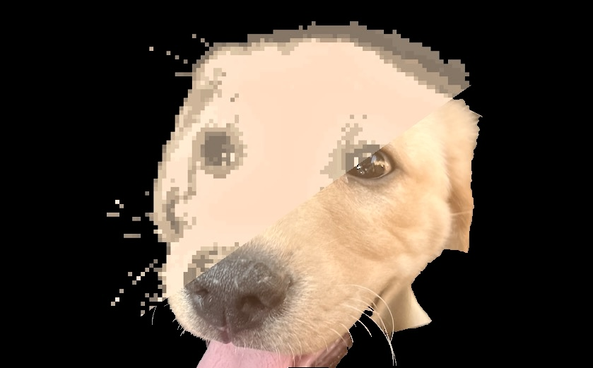
</p>

---

- [Features 🛠](#features-)
- [Installation 💻](#installation-)
- [Usage 🖱️](#usage-️)
- [Interface 🎨](#interface-)
- [How it works 🧙‍♂️](#how-it-works-️)
- [Contributing 🤝](#contributing-)
- [License 📄](#license-)

---

## Features 🛠

- **Pixel Art Creation**: Easily create and manipulate pixel art images.
- **Drawing Tools**: Use your mouse to draw on the board.
- **Color Palette Management**: Select from a range of colors or customize your own.
- **History Tracking**: Undo and redo actions to easily correct mistakes.
- **Pixel Size Adjustment**: Customize the size of the pixels for different artistic effects.
- **Image Quantization**: Reduce the number of colors in an image for a classic pixel art look.
- **File Management**: Open and save images in various formats.
- **Transparency**: Create transparent images for use in other applications.
- **GIF Creation**: Create animated GIFs from multiple images.

## Installation 💻

1. Ensure Python 3.x is installed on your system.
2. Clone the repository to your local machine.
3. Install the required Python packages.

## Usage 🖱️

To start the image editor, run the following command in the terminal:

```bash
python3 main.py
```

A window will open where you can select an image to edit. Use the various tools and sliders in the GUI to edit the image. If an image already exists in the program directory, it will be loaded automatically. Otherwise, you can open an image using the file menu, or from the command line:

```bash
python3 main.py path/to/image.png
```

## Interface 🎨

Note: This section was updated to reflect the new interface. The previous interface can be found in old versions of the repository.

Before you start editing the image, you can pass it throgh the `crop_background.py` script to remove the background. This script uses the `PIL` library to crop the background of the image. The script takes the image path as an argument and saves the cropped image in the program directory. You can also set adjust the area to crop.

<p align="center">
  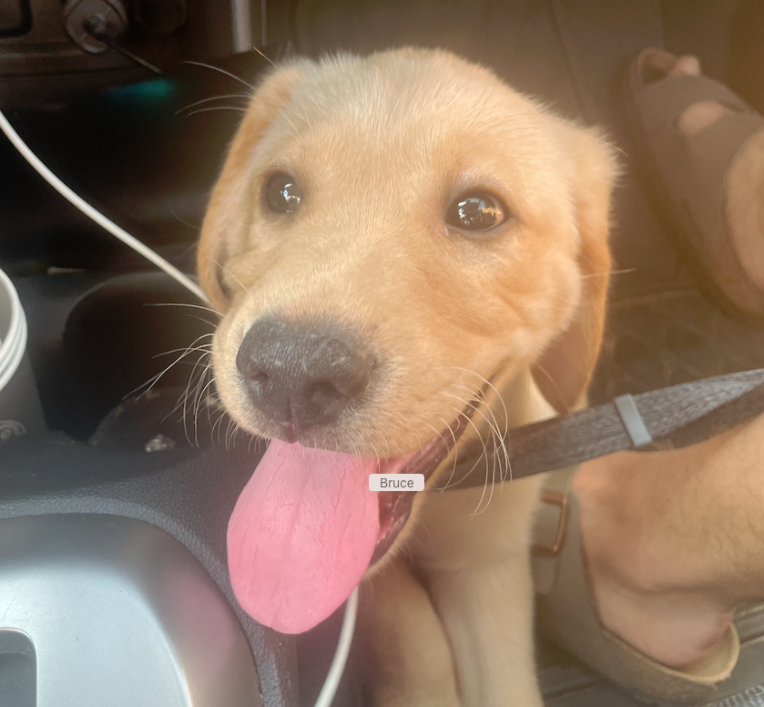
  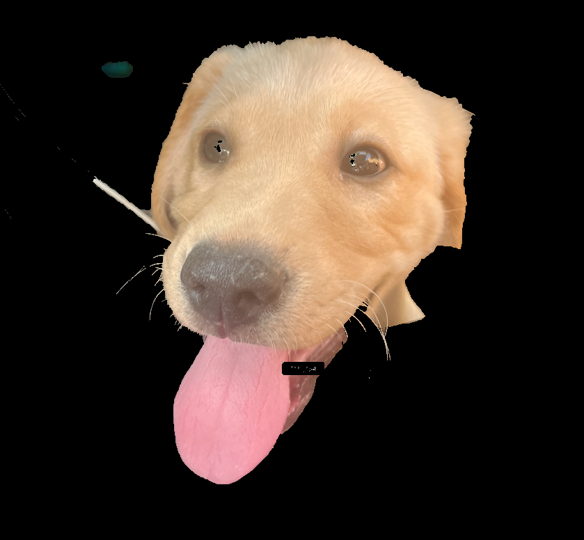
  <br>
  <i>Original image (left) and cropped image (right)</i>
</p>


<p align="center">
  
  <br>
  <i>Pixel Art Editor Interface</i>
</p>

<p align="center">
    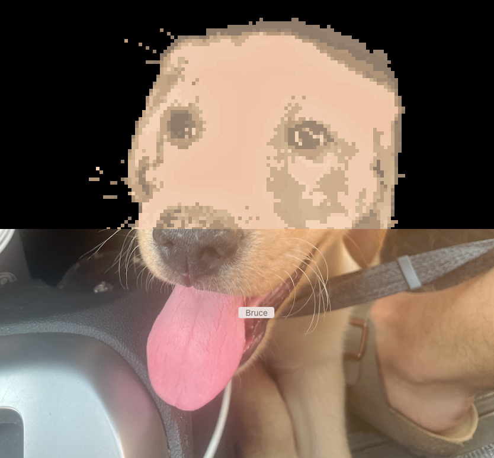
    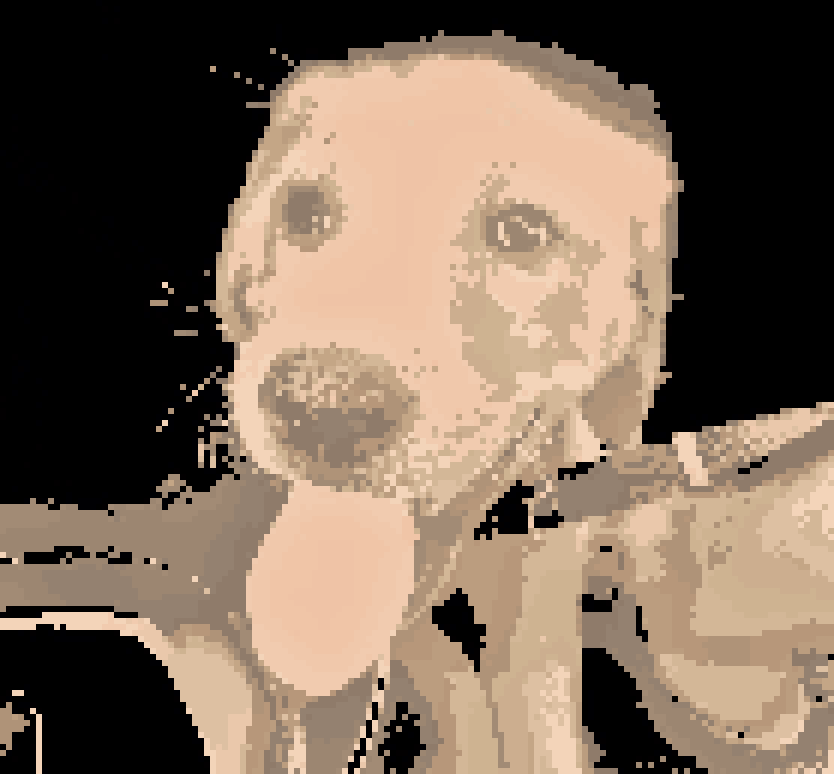
    <br>
  <br>
  <i>Example results: a 1-bit image and a 4-bit image</i>
</p>

The interface is divided into 2 parts:

- **Board**: The board is where the image is displayed. You can use the tools to edit the image by clicking on the board. The pixel you click on will be updated based on the color selected in the palette.

- **Tools**: The tools are located on the right side of the board. You can use the tools to draw, fill, or erase pixels. The tools can be selected by clicking on the buttons.

The tools include:

- **Draw**: Draw pixels on the board using the color selected in the palette (bottom left). You can change the color by clicking on the palette, and selecting a color from the color picker.

  <p align="center">
    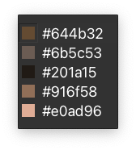
  </p>

- **Manipulate Pixel Size**: Change the size of the pixels on the board using the pixels slider. The pixel size is also the brush size when drawing on the board.

  <p align="center">
    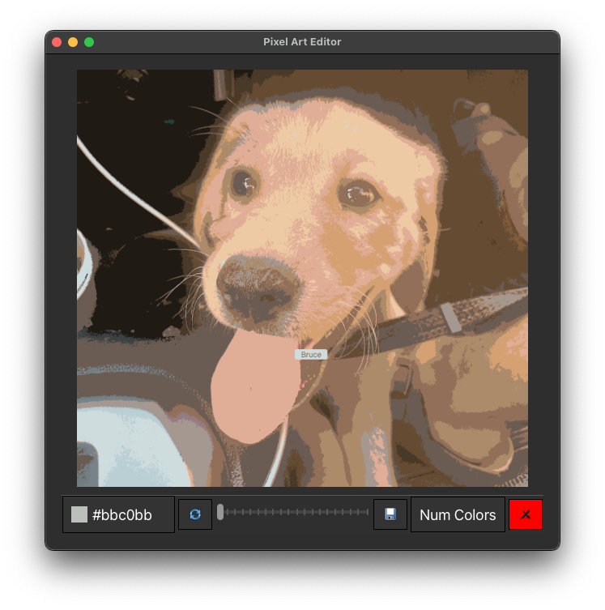
    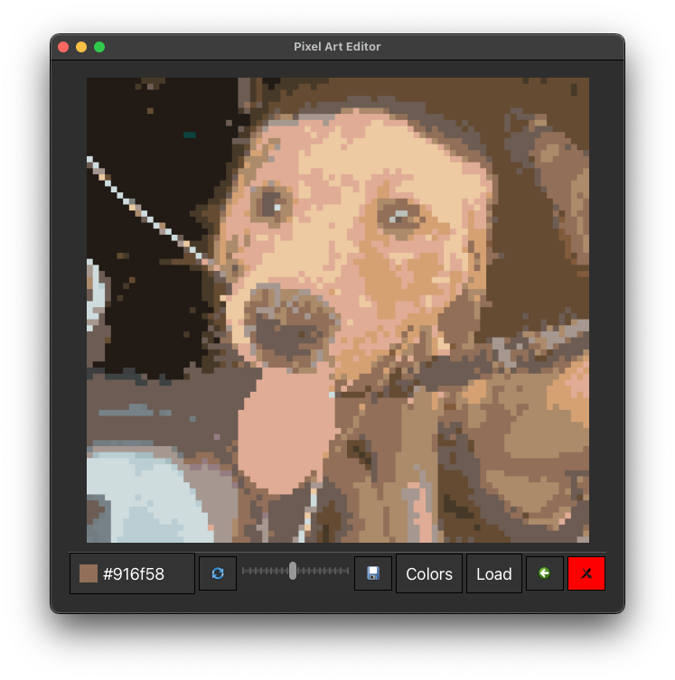
    <br>
    <i>Moving the slider to the right increases the number of pixels (decreases pixel size), resulting in a clearer image and smaller brush size. The name `Bruce` was hidden using the draw tool. Can you also notice two pixels changed in the right eye?</i>
  </p>

- **Change Number of Colors**: Reduce or increase the number of colors in the image using the colors slider. This is useful for color quantization, which reduces the number of colors in the image to a specified number.

  <p align="center">
    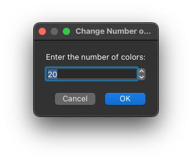
    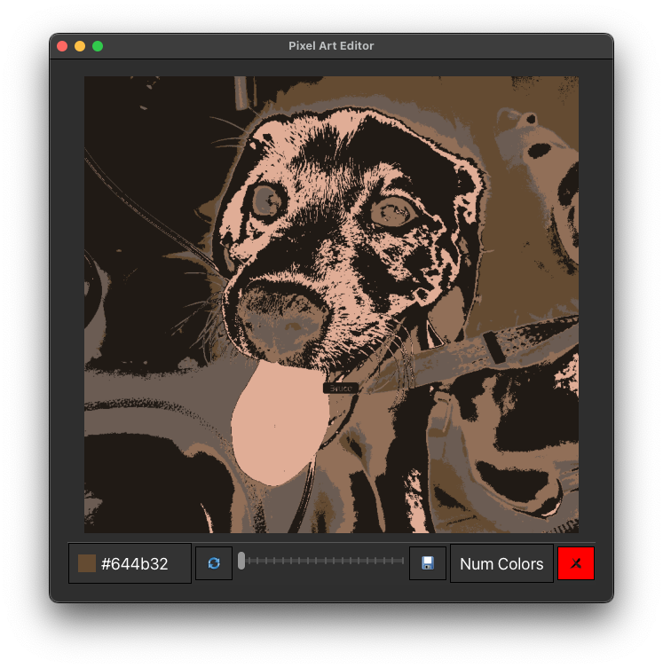
    <br>
    <i>Same image after reducing the color range. The color palette is updated accordingly.
    <br>
    The finale result used the `crop_background.py` for an artistic effect.</i>
  </p>

- **Save**: Save the image to the program directory. You can save the image in various formats, including PNG, JPEG, and GIF. After choosing the format, you can specify the name of the file and the location to save it. The `Transparent` optional allows you to save the image with a transparent background. This is useful for creating images that can be used in other applications.

<p align="center">
  
</p>

## How it works 🧙‍♂️

<p align="center">
  
  <br>
  <i>Me as a pixel art with transparent background</i>
</p>

The core functionality of the application lies in the `pixelate_image` method: it creates the pixelated version of the image by resizing the image to the desired pixel size, and then resizing it back to the original size. The processing also includes optionl color quantization, which reduces the number of colors in the image by grouping similar colors together.

The colors in the image are quantized using the `convert` method from the PIL library. The `ADAPTIVE` mode uses an adaptive palette to reduce the number of colors in the image. The `colors` parameter specifies the number of colors to use in the palette. The image is then resized back to the original size using the `resize` method.

```python
# from the PixelEditor class
def pixelate_image(self, image_path=None, pixel_size=None):
    """
    Pixelate the image.
    """
    pixel_size = pixel_size if pixel_size else self.pixel_size + 1
    if not image_path:
        image_path = self.image_path
    image = Image.open(image_path)
    image = image.resize(
        (image.size[0] // pixel_size,
         image.size[1] // pixel_size), Image.NEAREST
    )
    if self.num_colors:
        image = image.convert(
            "P", palette=Image.ADAPTIVE, colors=self.num_colors)
    self.pixel_size = pixel_size
    return image.resize(
        (image.size[0] * pixel_size, image.size[1]
         * pixel_size), Image.NEAREST
    )
```

The `save_history_before_action` decorator is used to save the current state of the image before an action is performed. The `save_to_history` method saves the current state of the image to the history list. The `undo` and `redo` methods are used to undo and redo actions, respectively. The `undo` method pops the last state from the history list and sets it as the current state of the image. The `redo` method pops the last state from the redo list and sets it as the current state of the image.

```python
def save_history_before_action(method):
    """
    Decorator to save the current state of the image before an action is performed.
    """

    def wrapper(self, *args, **kwargs):
        if len(self.history) > 10:
            self.history.pop(0)
        self.save_to_history()  # Save current state before action
        return method(self, *args, **kwargs)

    return wrapper
```

The design of the decorator was inspired by `Memento` design pattern, which is used to capture and externalize an object's internal state so that the object can be restored to this state later. However, the decorator is a simplified version of the `Memento` pattern, as it only saves the state of the image before an action is performed, and does not provide a way to restore the state of the image without using the `undo` and `redo` methods. A better implementation would be to save only the changes made to the image, rather than the entire image, to reduce memory usage. This was not implemented because the changes made to the image size and color quantization makes it difficult to later restore only the changes made to the image, without saving the entire image.

The image editor was originally built using the Matplotlib library. The board is a Matplotlib figure, and the pixels are Matplotlib patches. The color of each patch is updated when the user clicks on the board. For more modular code, the application was later updated to use the tkinter library, which provides a more user-friendly interface. It overrode the basic Matplotlib interface to provide a more interactive and user-friendly interface. In addition, the modular design makes it possible to use the `BoardGUI` class in other applications, for example, create a pixel art game.

```python
from matplotlib.backends.backend_qt5 import NavigationToolbar2QT as NavigationToolbar

class CustomToolbar(NavigationToolbar):
    """
    Custom toolbar for the pixel editor.
    """
    def __init__(self, canvas, parent=None, board_gui=None):
        super().__init__(canvas, parent)
        self.clear()
        self.color_plate_combobox = None
        self.reset_button = None
        self.exit_button = None
        self.save_button = None
        self.board_gui = board_gui
        self.init_buttons()
```

The `CustomToolbar` class is a custom toolbar for the pixel editor. It inherits from the `NavigationToolbar` class, which is a toolbar for Matplotlib figures. The `CustomToolbar` class overrides the `init_buttons` method to add custom buttons to the toolbar. The `color_plate_combobox` button is used to select the color palette. The `reset_button` button is used to reset the image to the original state. The `exit_button` button is used to exit the application. The `save_button` button is used to save the image to the program directory. The image also uses some of the built-in icons from the Matplotlib library. Take a look at the following example, wich show how the `Save` button is implemented:

```python

def init_save_button(self):
    self.save_button = QPushButton("", self)
    self.save_button.setIcon(
        self.style().standardIcon(QStyle.SP_DialogSaveButton))
    self.save_button.setToolTip("Save Image")
    self.save_button.setStyleSheet("""
        QPushButton {
            background-color: #333;
            color: #fff;
            border: 1px solid #000;
            padding: 10px;
            font-size: 18px;
        }
        QPushButton:hover {
            background-color: #666;
        }
        QPushButton:pressed {
            background-color: #999;
        }
    """)
    self.save_button.clicked.connect(self.save_image)
    self.addWidget(self.save_button)


def save_image(self):
    """
    Open a dialog box to save the image in different formats.
    """
    # choose saving format: transparent or not
    msg_box = QMessageBox(self)
    msg_box.setWindowTitle("Save Image")
    msg_box.setText("Choose saving format:")
    normal_button = msg_box.addButton("Normal", QMessageBox.ActionRole)
    transparent_button = msg_box.addButton(
        "Transparent", QMessageBox.ActionRole)
    cancel_button = msg_box.addButton("Cancel", QMessageBox.RejectRole)
    gif_button = msg_box.addButton("GIF", QMessageBox.ActionRole)
    msg_box.exec_()
    #...
```

The `css` style is used to style the buttons. The `background-color` property sets the background color of the button. The `color` property sets the text color of the button. The `border` property sets the border of the button. The `padding` property sets the padding of the button. The `font-size` property sets the font size of the button. The `hover` pseudo-class is used to style the button when the mouse hovers over it. The `pressed` pseudo-class is used to style the button when it is pressed. The `clicked` signal is connected to the `save_image` method, which is used to save the image to the program directory.

The `save_image` method opens a dialog box to save the image in different formats. The user can choose between saving the image with a transparent background, saving the image as a GIF, or saving the image with a normal background. The `QFileDialog` class is used to open a file dialog box to save the image. The `getSaveFileName` method is used to get the file path where the image will be saved. The file name is extracted from the file path, and the image is saved using the `save_image` method of the `PixelEditor` class. The `make_gif` method is used to create an animated GIF from multiple images. The `save_transparent_png` method is used to save the image as a PNG with a transparent background.

<p align="center">
  
  <br>
  <i>The board on a console interface - Stay tuned for updates! 🎮</i>
</p>

## Contributing 🤝

<p align="center">
  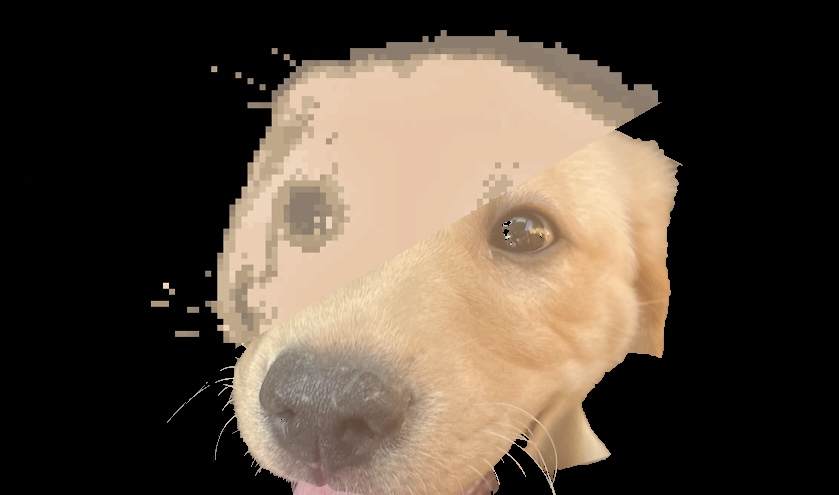
</p>

Contributions are welcome! Please feel free to submit a pull request or open an issue if you encounter any problems. This program is still in beta, and there are many features that can be added to improve the user experience, as well as the performance of the application. The following are some ideas for future improvements:

- **Extend the Drawing Tools**: Add more drawing tools, such as a line tool, a circle tool, and a rectangle tool.
- **Format Support**: Add support for more image formats, such as BMP, TIFF, and WebP.
- **Long Press**: Add support for long press events to draw multiple pixels at once.
- **Zoom In/Out**: Add support for zooming in and out of the image.
- **Layer Support**: Add support for layers to create more complex images.

## License 📄

This project is licensed under the MIT License - see the [LICENSE](LICENSE.md) file for details.
