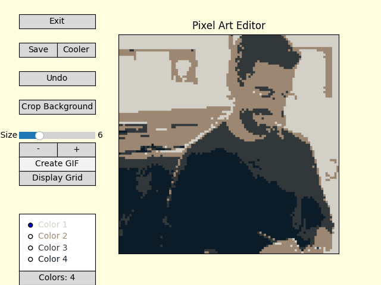
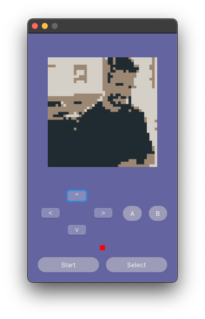
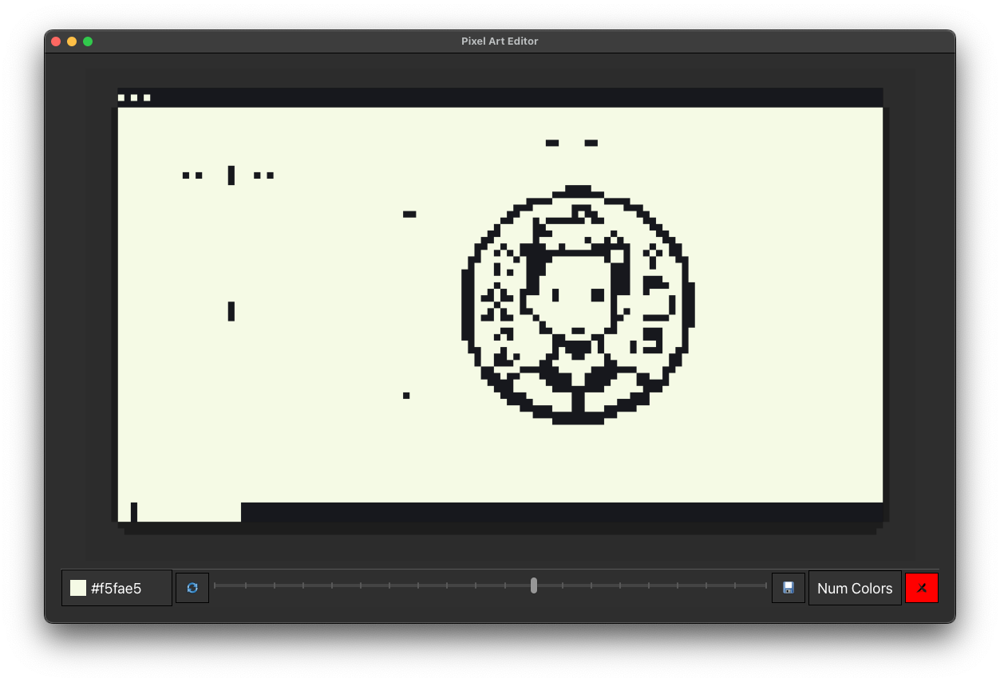
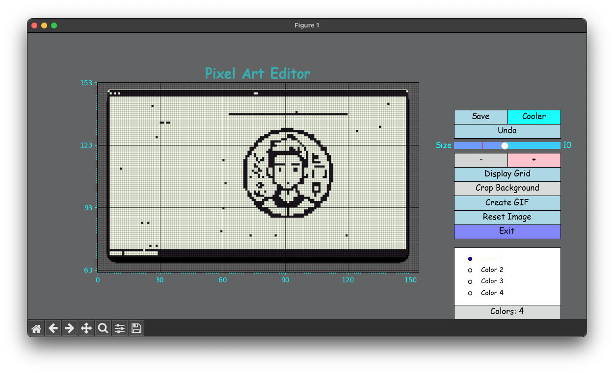

# The Python Pixel Art Editor (Beta) 🎨

This project presents a pixel art image editor developed in Python, offering a user-friendly interface and a variety of image editing tools. It's designed for artists, hobbyists, and anyone interested in pixel art creation.

<p align="center">
  
</p>

---

## Coming Soon: GameBoyAI (GBAI)

<p align="center">
<<<<<<< HEAD
  
  <br>
  <i>Stay tuned for updates! 🎮</i>
</p>

---

## Features 🛠

- **Pixel Art Creation**: Easily create and manipulate pixel art images.
- **Color Palette Management**: Select from a range of colors or customize your own.
- **History Tracking**: Undo and redo actions to easily correct mistakes.
- **Pixel Size Adjustment**: Customize the size of the pixels for different artistic effects.
- **Image Quantization**: Reduce the number of colors in an image for a classic pixel art look.
- **File Management**: Open and save images in various formats.
- **Transparency**: Create transparent images for use in other applications.

## Installation 💻

1. Ensure Python 3.x is installed on your system.
2. Clone the repository
3. Install the required packages

## Usage 🖱️

To start the image editor, run the following command in the terminal:

```bash
python3 main.py
```

A window will open where you can select an image to edit. Use the various tools and sliders in the GUI to edit the image. If an image already exists in the program directory, it will be loaded automatically. Otherwise, you can open an image using the file menu, or from the command line:

```bash
python3 main.py path/to/image.png
```

## Interface 🎨

<p align="center">
  
</p>

<p align="center">
  
</p>

The interface is divided into 4 parts:

- **Board**: The board is where the image is displayed. You can use the tools to edit the image by clicking on the board. The pixel you click on will be updated based on the color selected in the palette.

- **Palette**: The palette is where you can select the color you want to use. You can select from a range of colors or customize your own. The range of colors can be changed by adjusting the sliders below the palette.

- **Pixel Size**: The pixel size slider allows you to adjust the size of the pixels. This can be used to create different artistic effects.

- **Menu**: The menu in the top left allows you to save the image in different formats, or quit the application. below the menu is the history slider, which allows you to undo and redo actions.

## How it works 🧙‍♂️

<p align="center">
  
</p>

The image editor is built using the matplot library. The board is a matplot figure, and the pixels are matplot patches. The color of each patch is updated when the user clicks on the board. The main magic of the application is in the `pixelate_image`: it creates the pixelated version of the image by resizing the image to the desired pixel size, and then resizing it back to the original size. The processing also includes optionl color quantization, which reduces the number of colors in the image by grouping similar colors together.

## License 📄

This project is licensed under the MIT License - see the [LICENSE](LICENSE.md) file for details.
